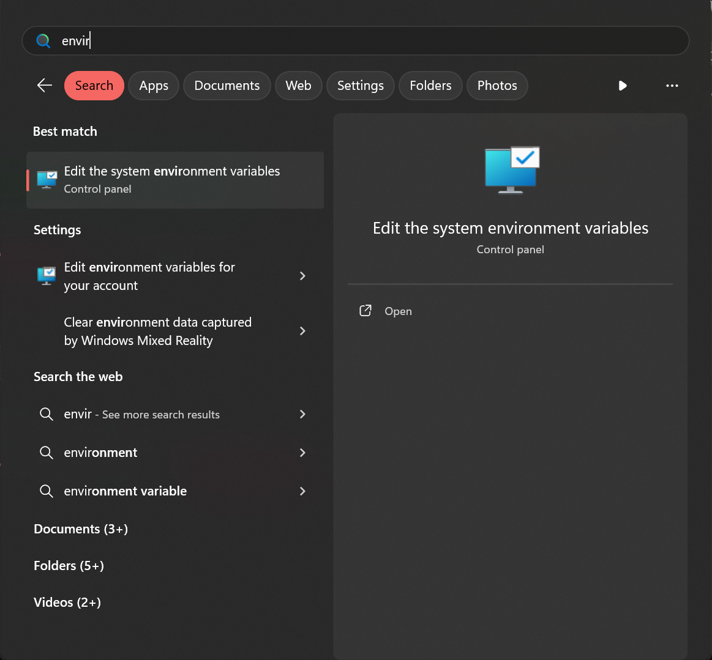
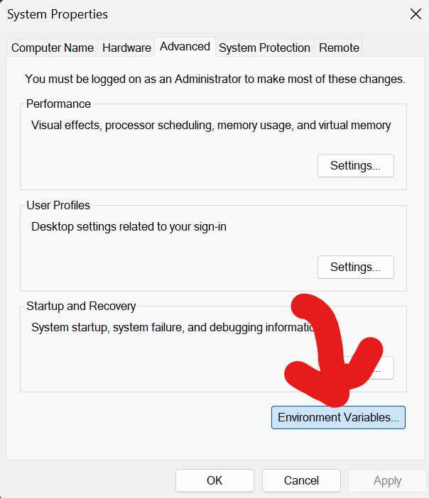
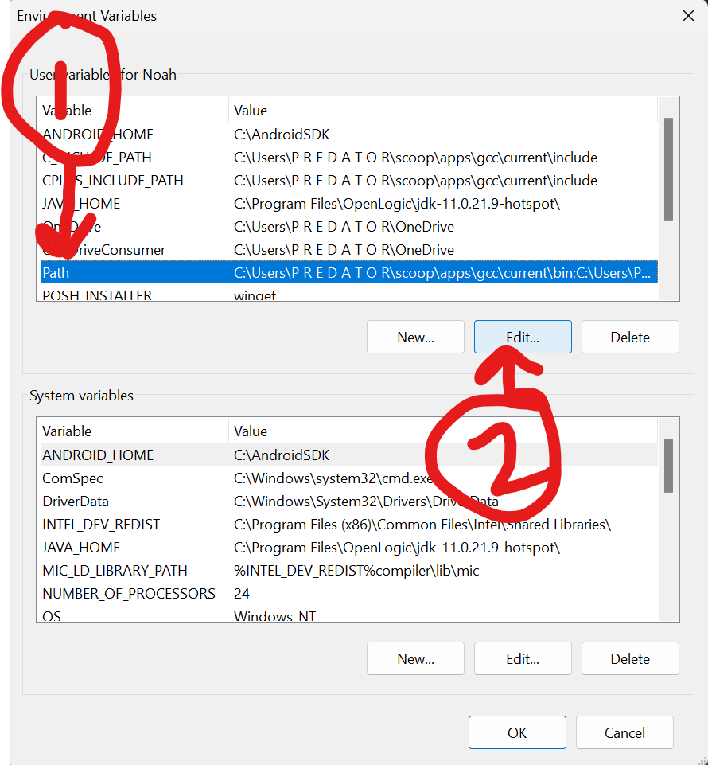
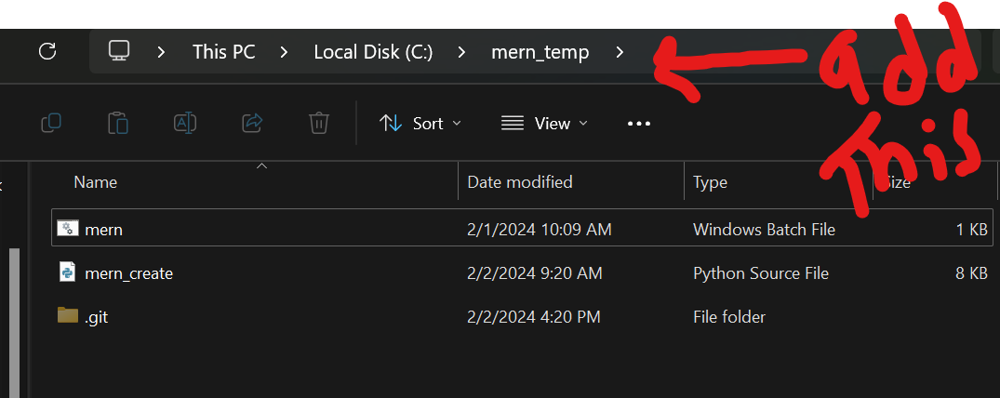
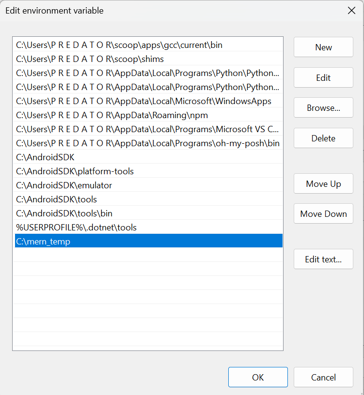
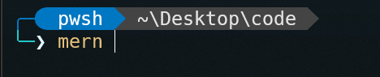

# MERN Creator Script v0.1 🐍

> This script will help you use premade setup for **MERN stack** application, you can use this script inside any folder and it will generate two folder: `Client` which has frontend and `Server` which has backend.
> <br> <br> <br><br><br><br>

---

<br>

`Using Script ( Powershell preferred )`

```
python mern_create.py
```

`or`
<br>

```
python3 mern_create.py
```

---

### How to use it in any folder with ease:

1. Go To `Environment variable` ( search it up )





2. Add The `path` to the folder where you have both the `mern_create.py` as well as `mern.bat` and save it.







3. Now you can type `mern` in any folder from terminal and it will work.



---

### 🧑‍🦰 Author: `Neek`

[](https://instagram.com/theonly.neek_)
<br>

---
